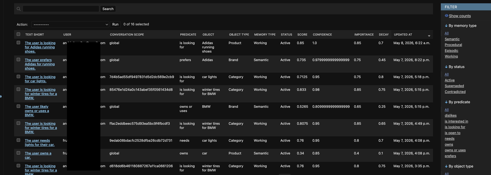

# preferences-engine
DICE-inspired AI-powered engine for inferring user preferences



## What Is DICE? (In Plain English)

Imagine you walk into a big store and a shop assistant comes up to help you.

But this assistant has a superpower: **they remember everything about you from every visit.**

**1. The assistant speaks the store's language**
Before talking to you, the assistant already knows how the store is organised: there are *Brands*, *Categories*, *Price ranges*, *Colors*. They know the difference between "I prefer Nike" and "I need running shoes under €80". They don't confuse products with brands, or wishes with budgets. The store taught them a map of its own world.

**2. After each visit, the assistant writes notes in your customer file**
"This customer hates leather. Loves Sony. Always shops for her husband, not herself. Budget usually under €100." These notes live in the store's own system — not on a sticky note that gets lost. Next time you walk in, the file is already there.

**3. Before greeting you, the assistant quickly skims your file**
Not the whole thing — just the most useful bits. The most recent, most certain facts. Then they greet you already knowing: *"Last time she was looking for a gift for her husband who likes tech and has a €150 budget."* You don't have to explain yourself again from scratch.

The result: instead of *"Hi! What are you looking for today?"* you get *"Welcome back! Still looking for something for your husband, or is this for yourself this time?"*

That's DICE. The store's domain knowledge, remembered in your file, injected into every conversation at exactly the right moment.

## What Is DICE? (Formal Definition)

Embabel's **Domain Injected Context Engineering (DICE)** is a framework for integrating domain models into LLM interactions.

**Full name used in research/source:** Domain Integrated Context Engineering (also rendered as Domain Injected Context Engineering).

Its four core principles are:

1. **Domain-first architecture** — domain objects and business ontology are the source of truth, not prompts.
2. **Structured bidirectional mapping** — domain structure applies to both inputs sent to LLMs and outputs received back.
3. **Code-driven context filtering** — code, not the LLM, decides what enters the context window.
4. **Persistent domain integration** — LLM-derived knowledge is grounded in existing persistence systems (SQL, graph, etc.), not greenfield vector stores.

DICE ships **no built-in entity types or predicates** — the entire schema is user-defined.

**Based on:** General User Models (GUM) research (Stanford/Microsoft, 76% accuracy for high-confidence propositions).

**Primary implementation:** Kotlin/Spring library — `https://github.com/embabel/dice` (commit researched: `90c00d93f8e347ebafa94cf8ba1c855b19eb22b1`). No Python SDK ships with the library.

### E-commerce Schema Example

```
Entity types: Customer, Product, Category, Brand, Feature, PriceRange
Predicates: prefers, dislikes/wants to avoid, is looking for, has budget of,
            owns, is interested in, needs
```

### The DICE Pipeline (3 Steps)

1. **Extract** — LLM reads the conversation turn + schema + existing propositions → returns JSON array of new propositions
2. **Revise** — deduplicate / update against existing store (exact match or embedding similarity)
3. **Inject** — top-N propositions by `importance × confidence` prepended to the agent's system prompt


### Memory Types

#### The Four Types

| Type | What it holds | Durability |
|------|--------------|------------|
| **semantic** | Stable facts about the user — "prefers Sony", "hates leather", "budget under €100" | Permanent (low decay) |
| **procedural** | How the user wants things done — "always show prices first", "don't suggest bundles" | Permanent |
| **episodic** | Specific past events — "bought running shoes last March", "asked about TVs in session X" | Medium-lived |
| **working** | In-session temporary context — "currently looking for a gift for her husband" | Expires fast (high decay) |

#### Semantic vs Working — The Critical Distinction

This is not just a label difference. It controls **where the memory is written** (`extraction.py:162–177`):

- **semantic / procedural / episodic** → saved to `global_writable` with `conversation_id=NULL` — survives across all future conversations.
- **working** → saved to `conversation_writable` tied to the current `conversation_id` — disappears when the conversation ends.


## Inspiration of this project

This implementation tries to follow the original [DICE](https://github.com/embabel/dice/tree/90c00d93f8e347ebafa94cf8ba1c855b19eb22b1) design and is heavily inspired by its code and the accompanying article: [Agents That Extract and Use Preferences from Conversations](https://medium.com/embabel/agents-that-extract-and-use-preferences-from-conversations-7b22cca9abb3).

There is also an idea to extend the inference signal beyond chat messages to include implicit user behavior — such as applied filters and item clicks — as additional sources for preference extraction.

Another planned direction is a user-facing API that gives users visibility and control over their inferred preferences — allowing them to inspect what has been inferred and selectively disable individual preferences or turn off inference entirely.

## Environment variables

| Variable | Required | Default | Description |
|---|---|---|---|
| `PREFERENCE_ENGINE_OPENAI_API_KEY` | Yes | — | OpenAI API key used for preference extraction |
| `PREFERENCE_ENGINE_OPENAI_MODEL` | No | `gpt-5.5` | OpenAI model used for extraction |

## Maintenance

### `expire_decayed_memories`

Scans all active preferences and marks any whose effective score (`importance × confidence × e^(−decay × age_months)`) has fallen below `DECAY_THRESHOLD = 0.05` as `SUPERSEDED`.

```bash
# Preview without writing
python manage.py expire_decayed_memories --dry-run

# Apply
python manage.py expire_decayed_memories
```

Intended to be run periodically as a cronjob, e.g. nightly:

```cron
0 2 * * * /path/to/venv/bin/python /path/to/manage.py expire_decayed_memories >> /var/log/expire_decayed_memories.log 2>&1
```

## DICE Compliance Summary Table

| DICE Principle | Status | Notes                                                                                |
|---|---|--------------------------------------------------------------------------------------|
| Typed domain ontology constraining LLM | ✅ Strong | `PreferenceSchema`, `DomainPredicate` with `allowed_object_types`                    |
| Structured bidirectional LLM mapping | ✅ Strong | `ExtractedProposition`, `RevisionResult` as Pydantic output types                    |
| Persistent ORM integration | ✅ Strong | Django/Postgres, full audit log via `UserPreferenceMemoryEvent`                      |
| Code-driven context ranking/filtering | ✅ Good | `inject_for_prompt` with `importance × confidence` ranking                           |
| Context actually injected into agent | ✅ Implemented | `known_preferences` appended to `prompt` in `sample.py` when non-empty               |
| Memory decay/expiration | ✅ Implemented | `effective_score()` filters at `DECAY_THRESHOLD`; management command for hard expiry |
| Live catalog grounding of domain schema | ⚠️ Partial | Static schema; no link to live `shop_assortment` data                                |
| Privacy / observation audit | ⚠️ Missing | No pre-extraction filter; no user-facing fact review or deletion                     |

---

## DICE Compliance Verdict

The architecture is **fully aligned with DICE in both design and operation**. The schema, structured outputs, ORM integration, two-phase extract/revise pipeline, decay-based filtering, and context injection are all in place. The two remaining gaps are secondary: the domain schema is static rather than grounded in live catalog data, and there is no privacy audit layer to gate what enters the memory store.

### Limitations

- **Domain**: hardcoded for e-commerce in [`preferences_engine/domain_schema.py`](preferences_engine/domain_schema.py); not yet configurable for other domains
- **LLM provider**: OpenAI only; no support for other providers
- **Memory**: Django ORM only; no adapter for other persistence layers
- **No audit module**: there is currently no mechanism to prevent extracting sensitive preferences — use with caution in production
